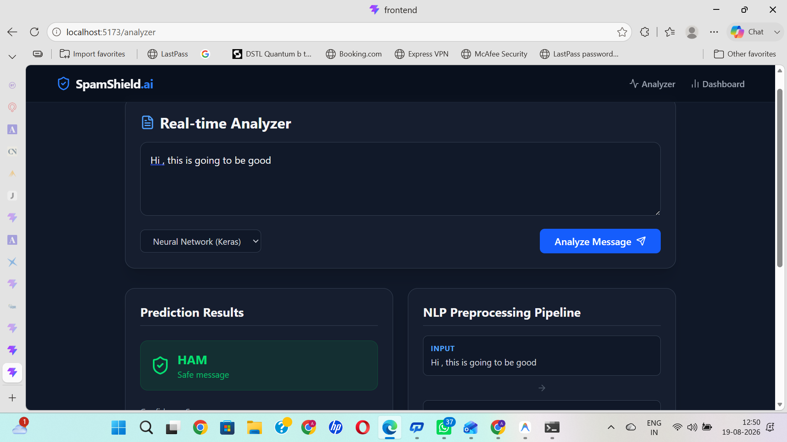
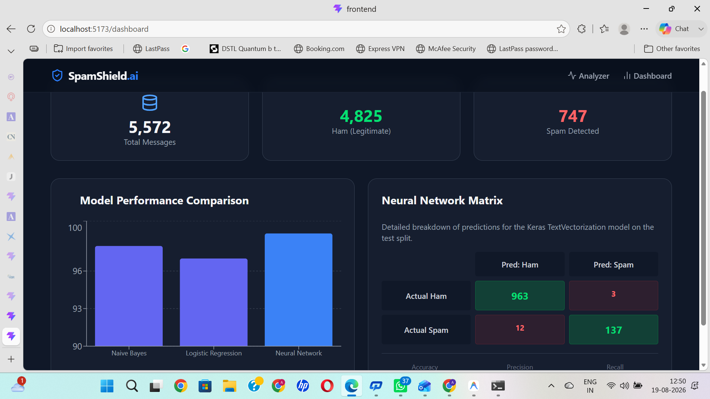

```markdown
<div align="center">
  
# 🛡️ SpamShield AI

**An AI-powered text intelligence platform for real-time SMS spam detection, built using NLP, Deep Learning, FastAPI, and React.**

[](#)
[](#)
[](#)
[](#)
[](#)

</div>

<br>

An end-to-end Machine Learning pipeline combined with a modern web application. SpamShield AI takes unstructured text, runs it through an advanced NLP processing pipeline, and evaluates it against multiple trained models to detect spam with extreme accuracy.

Trained and evaluated against the industry-standard **[UCI SMS Spam Collection dataset](https://archive.ics.uci.edu/ml/datasets/SMS+Spam+Collection)**.

---

## 📸 Screenshots

<p align="center">
  
  <br>
  <em>Real-time inference, NLP pipeline visualization, and keyword extraction</em>
</p>

<p align="center">
  
  <br>
  <em>Interactive analytics, confusion matrix, and model evaluation metrics</em>
</p>

---

## ✨ Key Features

- ⚡ **Real-Time Classification:** Instant multi-model predictions via REST API.
- 🧠 **Explainable AI:** Highlights the exact keywords that triggered the spam classification.
- 🔬 **NLP Pipeline Visualizer:** See exactly how the text is tokenized, stripped of punctuation, and filtered step-by-step.
- 📊 **Interactive Analytics:** A dedicated metrics dashboard utilizing Recharts to compare model accuracies, F1 scores, and a live Confusion Matrix.
- 🏎️ **Multiple Models Supported:** Hot-swap between a custom Keras Neural Network, Logistic Regression, and Multinomial Naive Bayes.
- 📦 **Reproducible Training Pipeline:** 100% reproducible Python training script that automatically downloads the dataset, processes it, and persists the `.keras` and `.pkl` artifacts.

---

## 🛠️ Technology Stack

| Category | Technologies |
|---|---|
| **Frontend UI** | React, Vite, Tailwind CSS v4, Recharts, Lucide Icons |
| **Backend API** | Python, FastAPI, Uvicorn |
| **Machine Learning** | TensorFlow / Keras, Scikit-learn, Pandas, NumPy |
| **NLP Processing** | NLTK (Tokenization, Stopwords) |

---

## 🚀 Running Locally

### 1. Backend Setup

Open a terminal and navigate to the backend directory:

```bash
cd backend
python -m venv venv

# Windows Activation
.\venv\Scripts\activate

# macOS/Linux Activation
source venv/bin/activate
```

Install dependencies and train the models:

```bash
pip install -r requirements.txt

# Run the training script (downloads dataset automatically)
python scripts/train.py

# Start the API server
uvicorn main:app --reload
```
*The API will now be running on `http://127.0.0.1:8000`*

### 2. Frontend Setup

Open a **new** terminal and navigate to the frontend directory:

```bash
cd frontend
npm install
npm run dev
```
*The Web App will now be running on `http://localhost:5173`*

---

## 📡 API Reference

The FastAPI backend provides auto-generated Swagger documentation. Once running, visit `http://127.0.0.1:8000/docs` to interact with the API endpoints:

- `GET /health` - Check API and model load status.
- `POST /api/v1/predict` - Predict spam on a single message and return explainability metrics.
- `POST /api/v1/batch-predict` - Upload a CSV for bulk predictions.
- `GET /api/v1/analytics` - Fetch dataset statistics and trained model metrics.

---
```
